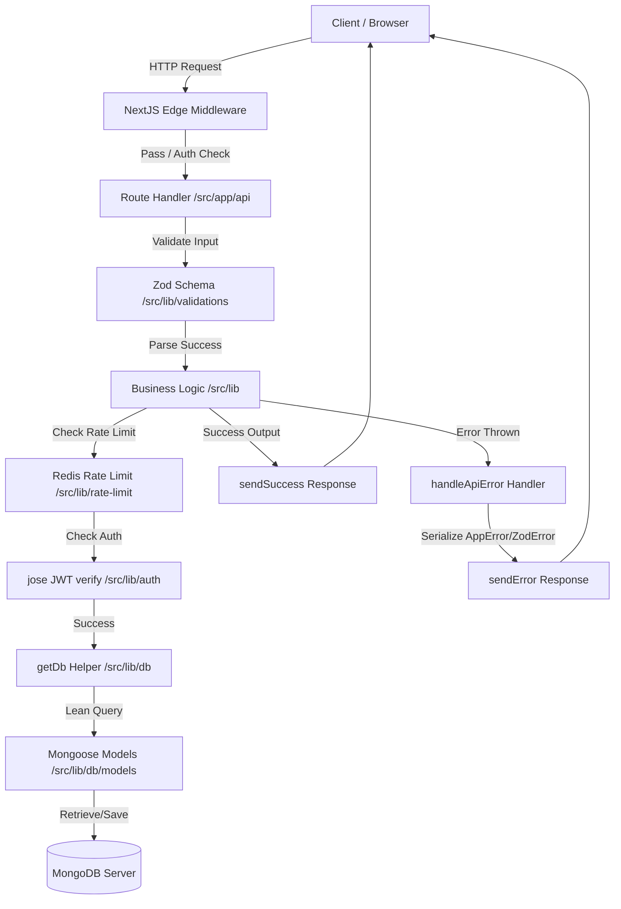
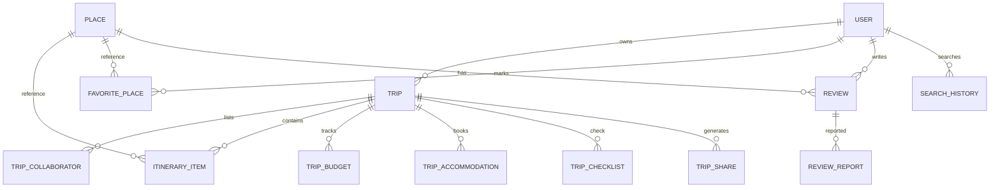
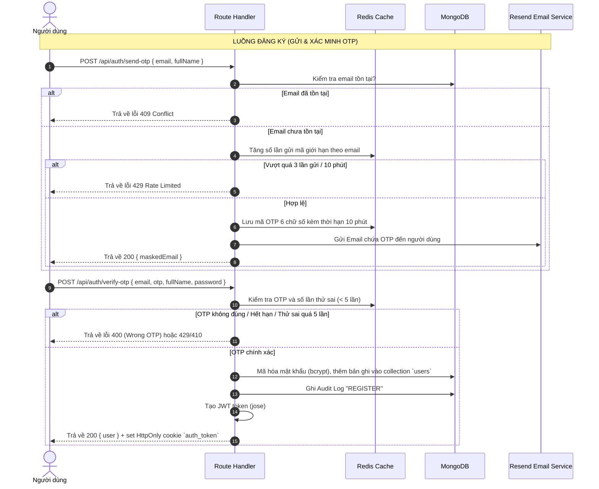
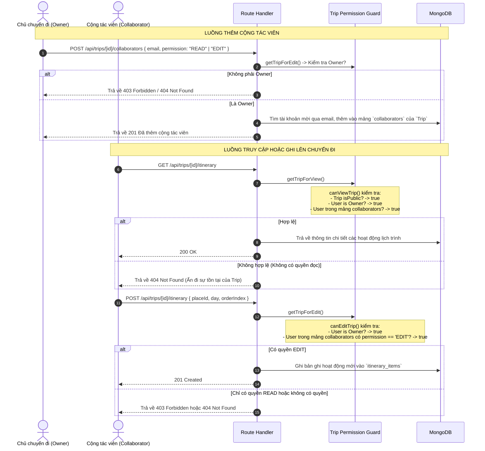

# BÁO CÁO KIỂM TOÁN VÀ ĐÁNH GIÁ DỰ ÁN (PROJECT AUDIT REPORT)
**Dự án:** Smart Travel Guide (Lotus Travel)  
**Ngày thực hiện:** 24/06/2026  
**Trạng thái kiểm tra:** Hoàn thành đợt quét mã nguồn tĩnh (Static Analysis), kiểm thử đơn vị/tích hợp (Vitest) và rà soát luồng nghiệp vụ thủ công.

---

## PHẦN 1: BẢN ĐỒ & KIẾN TRÚC DỰ ÁN

### 1. Công nghệ & Stack kỹ thuật (Technology Stack & Versions)

| Thành phần | Công nghệ | Phiên bản | Mô tả chi tiết |
| :--- | :--- | :--- | :--- |
| **Framework** | Next.js App Router | `16.2.6` | Ứng dụng React SSR/API Route (Next.js 16 App Router) |
| **Ngôn ngữ** | TypeScript | `5.x` | Chế độ kiểm tra nghiêm ngặt (`strict: true`) |
| **Thư viện UI** | React / React DOM | `19.2.4` | React 19 làm môi trường runtime chính |
| **Cơ sở dữ liệu** | MongoDB via Mongoose | `9.6.3` | Mongoose ODM quản lý kết nối, index và schema |
| **Cache & Queue** | Redis via ioredis | `5.11.0` | Dùng làm cache dữ liệu, giới hạn tần suất (rate limiting) và OTP |
| **Xác thực (Auth)**| JWT via jose | `6.2.3` | Token tự ký chữ ký số qua thuật toán HS256, lưu HttpOnly cookie |
| **Gửi Email** | Resend | `6.12.4` | Gửi mã xác nhận đăng ký/đặt lại mật khẩu |
| **Kiểm thử** | Vitest / Playwright | `4.1.8` / `1.61` | Vitest cho Unit/Integration, Playwright cho E2E testing |
| **CSS Styling** | Tailwind CSS | `4.x` | Dùng Tailwind CSS v4 |

---

### 2. Cấu trúc thư mục chi tiết (Folder Map)

```
├── middleware.ts              # Edge Middleware quản lý định tuyến, chặn route debug ở production
├── eslint.config.mjs          # Cấu hình kiểm tra cú pháp ESLint v9
├── package.json               # Quản lý script và dependency
├── tsconfig.json              # Cấu hình biên dịch TypeScript
├── vitest.config.ts           # Cấu hình môi trường chạy test Vitest
├── src/
│   ├── app/                   # Định tuyến App Router chính
│   │   ├── api/               # Chứa toàn bộ Route Handler (API Server-only)
│   │   │   ├── admin/         # API dành riêng cho quản trị viên (report reviews)
│   │   │   ├── auth/          # Đăng nhập, đăng ký, đăng xuất, OTP, quên mật khẩu
│   │   │   ├── cron/          # Lịch trình tự động chạy (weather alerts)
│   │   │   ├── debug/         # Các API kiểm tra trạng thái DB/Redis trong môi trường dev
│   │   │   ├── favorites/     # API CRUD lưu địa điểm yêu thích của người dùng
│   │   │   ├── hotels/        # API tìm kiếm và lấy đánh giá khách sạn
│   │   │   ├── places/        # API tìm kiếm Nominatim, POI Overpass địa điểm du lịch
│   │   │   ├── profile/       # API thay đổi thông tin cá nhân, avatar, mật khẩu
│   │   │   ├── reviews/       # API gửi nhận đánh giá địa điểm của người dùng
│   │   │   ├── search-history/# API lịch sử tìm kiếm địa điểm
│   │   │   ├── share/         # API tạo và giải mã liên kết chia sẻ hành trình công khai
│   │   │   ├── trips/         # API CRUD chuyến đi, chi tiết lịch trình, budget, accommodation, checklist
│   │   │   ├── users/         # API quản lý danh sách người dùng (admin)
│   │   │   └── webhook/       # API xử lý webhook quản trị (reset DB, seed VN, broadcast)
│   ├── components/            # Các React Component dùng chung và riêng
│   │   ├── ui/                # Các UI primitive cơ bản (Button, Input, Modal)
│   │   ├── auth/              # Form đăng ký, đăng nhập
│   │   ├── trips/             # Giao diện lập kế hoạch chuyến đi, checklist, cộng tác viên
│   │   ├── hotels/            # Giao diện gợi ý khách sạn, đánh giá khách sạn
│   │   ├── UserDropdown.tsx   # Dropdown menu người dùng trên Header
│   │   ├── AppHeader.tsx      # Header điều hướng chính
│   ├── hooks/                 # Custom React Hook client-side
│   ├── lib/                   # Chức năng dùng chung ở Server
│   │   ├── db/                # Tầng truy cập DB (MongoDB + Redis), schema, models
│   │   ├── validations/       # Schema validate đầu vào bằng Zod
│   │   ├── api-response.ts    # Tiêu chuẩn hóa Response: sendSuccess, sendError, AppError
│   │   ├── auth.ts            # Quản lý tạo/xác thực mã JWT, xoay vòng khóa bí mật (rotation key)
│   │   ├── rate-limit.ts      # Giới hạn số lượng request bằng Redis & Memory fallback
│   │   └── weather-alerts.ts  # Đánh giá cảnh báo thời tiết
│   ├── data/                  # Dữ liệu tĩnh như danh sách tỉnh thành (localities)
│   └── types/                 # Định nghĩa kiểu dữ liệu TypeScript (Trip, Profile, Place...)
└── tests/                     # Tệp tin kiểm thử tự động, cấu trúc đồng nhất với src/
```

---

### 3. Thiết kế tầng kiến trúc (Architectural Layers & Flow)

Kiến trúc dự án tuân theo luồng xử lý dữ liệu chặt chẽ từ khi nhận request đến lúc tương tác cơ sở dữ liệu:



#### Các thành phần chính trong kiến trúc:
1. **Middleware (`middleware.ts`):** 
   - Lọc và loại bỏ các header kiểm thử (`x-user-id`, `x-forwarded-user`) trong môi trường production để chống giả mạo danh tính (Impersonation).
   - Kiểm tra JWT thông qua HttpOnly cookie `auth_token`. Hỗ trợ tự động resign và refresh token nếu khóa bí mật được xoay vòng.
   - Chặn các API debug `/api/debug/*` tại môi trường production bằng mã trạng thái HTTP 404.
2. **Tiêu chuẩn hóa API Response (`src/lib/api-response.ts`):**
   - Lớp `AppError` kế thừa từ `Error` cho phép ném ngoại lệ kèm HTTP status code và mã lỗi nghiệp vụ cụ thể.
   - Hàm `sendSuccess` định dạng chuẩn response thành công: `{ success: true, status: 200, error: null, data: ... }`.
   - Hàm `sendError` định dạng chuẩn response thất bại: `{ success: false, status: 4xx/5xx, data: null, error: { code, message, details } }`.
   - Hàm `handleApiError` tự động bắt lỗi từ Zod (`ZodError` -> HTTP 400), lỗi trùng lặp dữ liệu trong MongoDB (mã lỗi `11000`/`11001` -> HTTP 409), lỗi nghiệp vụ `AppError` và các ngoại lệ không xác định khác (trả về HTTP 500 kèm thông báo ẩn tại production để bảo mật).
3. **Audit Log & Rate Limiting (`src/lib/db/audit.ts`, `src/lib/rate-limit.ts`):**
   - Hàm `createAuditLog` ghi nhận lại toàn bộ nhật ký chỉnh sửa chuyến đi, hành trình, đăng ký, đăng nhập,... để phục vụ mục đích kiểm toán bảo mật.
   - Hệ thống giới hạn tần suất gửi yêu cầu (`checkRateLimit`) hoạt động dựa trên Redis. Nếu Redis gặp sự cố, hệ thống tự động fallback sử dụng bộ nhớ đệm trong RAM của ứng dụng (`memoryLimits` Map) giúp dịch vụ không bị gián đoạn.

---

### 4. Mô hình dữ liệu & Mối quan hệ (Data Model)

Hệ thống lưu trữ dữ liệu dạng tài liệu phi cấu trúc thông qua 16 collection chính:



- **`User` (Người dùng):** Lưu thông tin tài khoản, cấu hình ngưỡng cảnh báo thời tiết (`weatherAlerts`), và lịch trình du lịch ưa thích.
- **`Trip` (Chuyến đi):** Đại diện cho một hành trình. Chứa thông tin về người tạo (`userId`) và mảng `collaborators` chứa các cộng tác viên được phân quyền `READ` hoặc `EDIT`.
- **`TripCollaborator` (Mảng nhúng trong Trip):** Chứa `userId` của cộng tác viên, quyền hạn (`permission`: `READ`/`EDIT`), thời gian mời và thời gian đồng ý nhận lời mời.
- **`ItineraryItem` (Chi tiết địa điểm dừng chân):** Lưu thứ tự tham quan (`orderIndex`), ngày tham quan (`day`), thông tin thời gian bắt đầu/kết thúc, và chi phí phát sinh tại một địa điểm (`placeId`).
- **`Place` (Địa điểm):** Lưu thông tin địa lý (tên, tọa độ, địa chỉ, tag loại hình du lịch) được lưu từ Nominatim / Overpass hoặc các địa điểm tùy chỉnh do người dùng tự tạo.
- **`Hotel` (Khách sạn):** Thông tin chi tiết về cơ sở lưu trú để gợi ý cho chuyến đi.
- **`FavoritePlace` (Địa điểm yêu thích):** Bảng trung gian liên kết giữa `User` và `Place`.
- **`Review` (Đánh giá địa điểm):** Cho phép người dùng đánh giá điểm đến kèm theo số sao (`rating`) và nhận xét. Hỗ trợ bình luận lồng nhau qua trường `parentId`.
- **`ReviewReport` (Báo cáo đánh giá xấu):** Lưu thông tin khi người dùng khác báo cáo một đánh giá vi phạm quy chuẩn cộng đồng.
- **`TripShare` (Chia sẻ hành trình):** Lưu mã chia sẻ (`shareCode`), chuyến đi liên quan (`tripId`), cờ hoạt động (`isActive`) và thời gian hết hạn (`expiresAt`).

---

### 5. Biến môi trường & Secret được sử dụng (Environment Variables)

Hệ thống khai thác các biến cấu hình tại tệp `.env` thông qua tệp kiểm tra kiểu Zod [env.ts](file:///d:/LapTrinhAI/DATTCNPM/src/lib/env.ts):
- `NODE_ENV`: Môi trường vận hành (`development`, `test`, `production`).
- `JWT_SECRET`: Khóa bí mật dùng để ký và xác thực token JWT (hỗ trợ nhiều khóa phân cách bằng dấu phẩy phục vụ xoay vòng khóa).
- `MONGODB_URI` / `MONGO_URI`: Chuỗi kết nối đến cơ sở dữ liệu MongoDB.
- `REDIS_URL`: Chuỗi kết nối đến Redis server.
- `WEBHOOK_SECRET`: Khóa bí mật xác thực quyền gọi Webhook từ quản trị viên.
- `WEBHOOK_IP_ALLOWLIST`: Danh sách IP được phép gọi các hành động nhạy cảm của webhook (ví dụ: reset DB).
- `TRUSTED_PROXY_CIDRS`: Danh sách dải mạng proxy đáng tin cậy phục vụ giải nén IP thực tế từ header `x-forwarded-for`.
- `CRON_SECRET`: Khóa bí mật xác thực quyền kích hoạt lịch trình tự động (weather alerts).
- `DEBUG_SECRET`: Khóa bí mật mở rộng các route kiểm tra lỗi.
- `API_KEY_RESEND`: Khóa kết nối dịch vụ gửi mail Resend.
- `NEXT_PUBLIC_APP_URL`: URL công khai của Client phục vụ ghép nối liên kết.
- `NEXT_PUBLIC_BASE_URL`: URL API cơ sở.

---

## PHẦN 2: WORKFLOW CHI TIẾT CÁC LUỒNG NGHIỆP VỤ CHÍNH

### 1. Quy trình Đăng ký, Đăng nhập & Xác minh OTP



- **Đăng nhập (`POST /api/auth/login`):**
  - **Tệp tin:** [login/route.ts](file:///d:/LapTrinhAI/DATTCNPM/src/app/api/auth/login/route.ts#L9)
  - **Quy trình:** Nhận email/password -> Check rate limit theo `rl:login:{ip}:{email}` -> Tìm tài khoản còn hoạt động trong DB -> Kiểm tra trạng thái khóa `isLocked` -> Đối khớp hash mật khẩu qua `bcrypt.compare` -> Ghi log audit `LOGIN` -> Đặt cookie JWT `auth_token` kèm maxAge tùy thuộc vào tùy chọn `rememberMe`.

---

### 2. Quản lý Chuyến đi & Phân quyền Chủ sở hữu vs Cộng tác viên (Owner vs Collaborator)

Dưới đây là luồng phân quyền đọc/ghi chi tiết giữa Chủ chuyến đi và Cộng tác viên:



- **Tạo chuyến đi (`POST /api/trips`):**
  - **Tệp tin:** [trips/route.ts](file:///d:/LapTrinhAI/DATTCNPM/src/app/api/trips/route.ts#L45)
  - **Quy trình:** Giải nén token JWT lấy `userId` -> Validate đầu vào bằng Zod -> Lấy ngày bắt đầu địa phương bằng `toLocaleDateString('sv-SE')` đưa về 00:00:00 UTC tránh lệch múi giờ -> Thêm bản ghi chuyến đi -> Tạo nhật ký audit `CREATE_TRIP`.

- **Xóa chuyến đi (`DELETE /api/trips/[id]`):**
  - **Tệp tin:** [trips/[id]/route.ts](file:///d:/LapTrinhAI/DATTCNPM/src/app/api/trips/[id]/route.ts#L101)
  - **Quy trình:** Xác minh chủ chuyến đi qua `findOwnedTrip` -> Kích hoạt xóa toàn bộ tài liệu phụ thuộc ở các bảng liên kết thông qua helper `deleteTripCascade` (bao gồm `itineraryItems`, `tripBudgets`, `tripAccommodations`, `tripChecklists`, `tripShares`) -> Tiến hành xóa chuyến đi khỏi collection `trips` -> Lưu nhật ký audit `DELETE_TRIP`.

---

### 3. Hoạt động Itinerary, Favorites, Reviews & Reports

- **Xếp lại thứ tự hoạt động hành trình (`PATCH /api/trips/[id]/itinerary/reorder`):**
  - **Tệp tin:** [itinerary/reorder/route.ts](file:///d:/LapTrinhAI/DATTCNPM/src/app/api/trips/[id]/itinerary/reorder/route.ts#L14)
  - **Quy trình:** Xác minh quyền ghi của người chỉnh sửa -> Nhận mảng danh sách ID mới đã sắp xếp (`orderedIds`) -> Tải danh sách hiện tại đối khớp kiểm tra quyền sở hữu -> Thực hiện 2 pha cập nhật bằng `bulkWrite`: **Pha 1** đặt chỉ số tạm thời số âm (`-index - 1`) để không vi phạm ràng buộc độc nhất `unique index { tripId, day, orderIndex }` trong MongoDB; **Pha 2** gán chỉ số sắp xếp chuẩn không âm từ `0` đến `n-1`. Nếu một trong hai pha gặp lỗi, hệ thống tự động chạy tác vụ bù đắp (compensating write) để hồi phục lại trạng thái cũ của `orderIndex`.

- **Đánh giá địa điểm & Xử lý báo cáo vi phạm (`POST /api/reviews/[id]/report`):**
  - **Tệp tin:** [reviews/[id]/report/route.ts](file:///d:/LapTrinhAI/DATTCNPM/src/app/api/reviews/[id]/report/route.ts#L13)
  - **Quy trình:** Giải nén `userId` -> Tìm đánh giá gốc hoạt động -> Chặn hành vi tự báo cáo đánh giá của chính mình -> Thực hiện insert vào bảng `reviewReports` -> Nếu xảy ra lỗi khóa trùng lặp (lỗi code 11000 - đã báo cáo trước đó) thì trả về lỗi 409 Conflict cụ thể.

---

### 4. Chia sẻ chuyến đi công khai qua mã liên kết (Trip Sharing)

- **Tạo liên kết chia sẻ (`POST /api/trips/[id]/share`):**
  - **Tệp tin:** [trips/[id]/share/route.ts](file:///d:/LapTrinhAI/DATTCNPM/src/app/api/trips/[id]/share/route.ts#L16)
  - **Quy trình:** Xác minh quyền sở hữu chuyến đi của người yêu cầu -> Sinh mã ngẫu nhiên qua hàm mã hóa an toàn `crypto.randomBytes(12)` -> Thiết lập thời hạn mặc định là 30 ngày -> Thực hiện ghi vào bảng `tripShares`. Cơ chế thử lại tối đa 5 lần nếu gặp lỗi xung đột khóa trùng lặp `11000` của `shareCode`.
  
- **Giải mã liên kết (`GET /api/share/[code]`):**
  - **Tệp tin:** [share/[code]/route.ts](file:///d:/LapTrinhAI/DATTCNPM/src/app/api/share/[code]/route.ts#L9)
  - **Quy trình:** Nhận mã `shareCode` -> Truy vấn trong bảng `tripShares` còn hoạt động (`isActive: true`) -> Kiểm tra thời gian hết hạn -> Lấy thông tin chuyến đi tương ứng -> Lấy toàn bộ các điểm dừng chân trong chuyến đi -> Chọn lọc trả về các thuộc tính công khai an toàn (bỏ đi các thông tin nhạy cảm của người dùng).

---

### 5. Lịch trình tự động (Cron Job) & Webhook quản lý hệ thống

- **Weather Alerts Cron Job (`POST /api/cron/weather-alerts`):**
  - **Tệp tin:** [cron/weather-alerts/route.ts](file:///d:/LapTrinhAI/DATTCNPM/src/app/api/cron/weather-alerts/route.ts#L53)
  - **Quy trình:** Xác minh token từ Header `x-cron-secret` -> Tìm các chuyến đi chuẩn bị xuất hành trong 24 giờ tiếp theo -> Gom nhóm `userId` và tải thông tin cấu hình người dùng (ngưỡng nhiệt độ/lượng mưa) để tránh N+1 truy vấn -> Tải dữ liệu dự báo từ Open-Meteo và lưu cache theo tọa độ -> So sánh dữ liệu thực tế với ngưỡng cấu hình -> Tạo thông báo `WEATHER_ALERT` gửi đến tài khoản người dùng -> Gửi Email qua dịch vụ Resend -> Lưu cờ đánh dấu đã gửi vào Redis với TTL 24 giờ để tránh gửi thông báo trùng lặp. Tác vụ được thực hiện song song giới hạn tối đa (`concurrency pool` giới hạn là 8) để nâng cao hiệu suất.

- **System Webhook (`POST /api/webhook`):**
  - **Tệp tin:** [webhook/route.ts](file:///d:/LapTrinhAI/DATTCNPM/src/app/api/webhook/route.ts#L36)
  - **Quy trình:** Xác thực token Header `x-webhook-secret` -> Kiểm tra IP gửi request có nằm trong danh sách trắng cấu hình hay không (`WEBHOOK_IP_ALLOWLIST`) -> Tùy theo tham số sự kiện để thực thi các tác vụ đặc quyền: dọn dẹp hệ thống cơ sở dữ liệu (`db.reset`, `db.nuke`), khóa/mở khóa/xóa tài khoản người dùng, hoặc phát thông báo hệ thống trên diện rộng đến toàn bộ người dùng (`notification.broadcast`).

---

## PHẦN 3: DÒ BUG LẦN NỮA (INDEPENDENT AUDIT Sweep)

Đợt quét mã nguồn tĩnh chuyên sâu đã rà soát toàn bộ cấu trúc định tuyến và các module xử lý nghiệp vụ chính. Dưới đây là các phát hiện độc lập và phương án xử lý:

### 1. Bảng tổng hợp phát hiện lỗi (Bug & Vulnerability Tracking)

| STT | File & Dòng | Hàm / Module | Loại phát hiện | Mức độ | Mô tả lỗi phát hiện | Phương án sửa đổi đề xuất |
| :--- | :--- | :--- | :--- | :--- | :--- | :--- |
| **1** | [route.ts](file:///d:/LapTrinhAI/DATTCNPM/src/app/api/share/[code]/route.ts#L25) | `GET` | Bảo mật / Ẩn danh tính | **Medium** | Không kiểm tra cờ `deletedAt` hoặc trạng thái ẩn tư của chuyến đi gốc trong API chia sẻ công khai khi liên kết còn hoạt động. | Loại bỏ quyền xem nếu chuyến đi đã bị xóa mềm (`deletedAt !== null`). |
| **2** | [route.ts](file:///d:/LapTrinhAI/DATTCNPM/src/app/api/webhook/route.ts#L308) | `system.users` | Bảo mật / Rò rỉ dữ liệu | **Low** | API admin webhook trả về thông tin danh sách toàn bộ người dùng nhưng không ẩn đi các tài khoản đã bị xóa mềm (`deletedAt` khác null), gây rác dữ liệu quản trị. | Thêm bộ lọc `{ deletedAt: null }` trong câu lệnh find nếu chỉ cần hiển thị tài khoản đang hoạt động. |
| **3** | [route.ts](file:///d:/LapTrinhAI/DATTCNPM/src/app/api/cron/weather-alerts/route.ts#L99) | `processTrip` | Hiệu năng / N+1 Query | **Medium** | Tải danh sách `itineraryItems` của từng Trip trong vòng lặp song song. Nếu có nhiều Trip cùng chạy, có thể gây quá tải xung nhịp DB. | Tải toàn bộ `itineraryItems` của tập hợp trips cần chạy trước khi bắt đầu lặp bằng một câu truy vấn `$in`. |
| **4** | [route.ts](file:///d:/LapTrinhAI/DATTCNPM/src/app/api/favorites/route.ts#L91) | `POST` | Logic dữ liệu | **Low** | Khi tạo điểm yêu thích mới mà chưa có địa điểm trong DB, tọa độ được gán mặc định là `0` thay vì trả lỗi yêu cầu truyền tọa độ hoặc thực hiện tìm kiếm đảo (reverse lookup). | Bắt buộc kiểm tra hoặc validate tọa độ hợp lý thông qua schema Zod trước khi tạo Place tùy chỉnh mới. |

---

### 2. Chi tiết phân tích các lỗi phát hiện & Mã nguồn đề xuất

#### Phát hiện 1: Thiếu kiểm tra trạng thái xóa mềm chuyến đi trong API giải mã liên kết chia sẻ công khai
- **Tệp tin:** [src/app/api/share/[code]/route.ts](file:///d:/LapTrinhAI/DATTCNPM/src/app/api/share/[code]/route.ts#L25-L28)
- **Đoạn code chứa lỗi:**
  ```typescript
      const trip = await db.trips.findById(share.tripId);
      if (!trip) {
        throw new AppError('NOT_FOUND', 'Chuyến đi không tồn tại', 404);
      }
  ```
- **Phân tích:** Mặc dù chuyến đi đã bị xóa mềm (`deletedAt` có giá trị thời gian xóa) do chủ chuyến đi thực hiện, người ngoài nắm giữ `shareCode` cũ vẫn có thể đọc được toàn bộ thông tin chuyến đi và các hoạt động lịch trình đi kèm do API giải mã không kiểm tra thuộc tính `deletedAt` của chuyến đi gốc.
- **Cách khắc phục đề xuất:**
  ```typescript
      const trip = await db.trips.findById(share.tripId);
      if (!trip || trip.deletedAt) {
        throw new AppError('NOT_FOUND', 'Chuyến đi không tồn tại hoặc đã bị xóa', 404);
      }
  ```

#### Phát hiện 2: Truy vấn N+1 Itinerary Items trong tác vụ tự động gửi cảnh báo thời tiết (Cron)
- **Tệp tin:** [src/app/api/cron/weather-alerts/route.ts](file:///d:/LapTrinhAI/DATTCNPM/src/app/api/cron/weather-alerts/route.ts#L99-L101)
- **Đoạn code chứa lỗi:**
  ```typescript
        const items = (await db.itineraryItems.find({ tripId })) as ItineraryItem[];
        const placeIds = [...new Set(items.map((i) => String(i.placeId)).filter(Boolean))];
        const places = placeIds.length ? ((await db.places.find({ _id: { $in: placeIds } })) as Place[]) : [];
  ```
- **Phân tích:** Trong hàm xử lý song song `processTrip`, ứng dụng gọi `db.itineraryItems.find` độc lập cho từng chuyến đi để tìm tọa độ các địa danh dừng chân. Việc này tạo ra hàng loạt kết nối/truy vấn rời rạc lên MongoDB (vấn đề N+1 truy vấn đọc).
- **Cách khắc phục đề xuất:** Gom toàn bộ ID của các chuyến đi sẽ chạy, thực hiện truy vấn nạp trước (eager loading) toàn bộ danh sách `itineraryItems` đi kèm, sau đó map lại theo `tripId` tại RAM để xử lý offline:
  ```typescript
      const tripIds = trips.map(t => String(t._id));
      const allItineraryItems = await db.itineraryItems.find({ tripId: { $in: tripIds } });
      // Gom nhóm theo tripId ở bộ nhớ đệm
  ```

---

## KẾT LUẬN & ĐỀ XUẤT ƯU TIÊN

### 1. Điểm mạnh kiến trúc (Architectural Strengths)
- **Kiểm tra kiểu dữ liệu & đầu vào nghiêm ngặt:** Toàn bộ API đều triển khai validation thông qua Zod schema, kết hợp lớp xử lý lỗi tự động tập trung `handleApiError` giúp loại bỏ hoàn toàn các lỗi crash 500 do định dạng dữ liệu không hợp lệ.
- **Bảo vệ quyền riêng tư hiệu quả:** Các cơ chế bảo mật (như dùng mã lỗi 404 thay cho 403 khi truy cập trái phép hành trình riêng tư) giúp hạn chế rò rỉ cấu trúc dữ liệu và chống khai thác brute-force ID chuyến đi.
- **Hệ thống Fallback đáng tin cậy:** Cơ chế rate limiting và lưu trữ avatar hỗ trợ chuyển đổi linh hoạt sang RAM cache khi kết nối Redis gặp sự cố, đảm bảo dịch vụ không bị gián đoạn.

### 2. Rủi ro lớn nhất (Key Security Risks)
- **Truy cập thông tin chuyến đi đã xóa:** Việc không kiểm tra trạng thái xóa mềm chuyến đi trong API giải mã `shareCode` có thể tạo ra lỗ hổng rò rỉ dữ liệu lịch trình của người dùng đã xóa.
- **Tiêu tốn tài nguyên DB khi chạy Cron:** Việc lặp truy vấn Itinerary/Place cho từng Trip trong Cron Weather Alerts có thể tạo áp lực đọc lớn lên DB khi số lượng chuyến đi của hệ thống tăng cao.

### 3. Checklist ưu tiên xử lý (Priority Action Checklist)
- [ ] **Ưu tiên 1 (Bảo mật):** Thêm điều kiện kiểm tra `deletedAt` cho bảng `Trip` tại API lấy chi tiết chia sẻ hành trình công khai `/api/share/[code]`.
- [ ] **Ưu tiên 2 (Hiệu năng):** Refactor luồng truy vấn Itinerary Items trong Cron Job thành truy vấn nạp trước hàng loạt (Bulk Fetch) để loại bỏ rủi ro quá tải database.
- [ ] **Ưu tiên 3 (Tối ưu dữ liệu):** Bổ sung ràng buộc tọa độ trong Zod schema khi người dùng tạo điểm yêu thích mới để hạn chế rác tọa độ 0/0 trong database.
