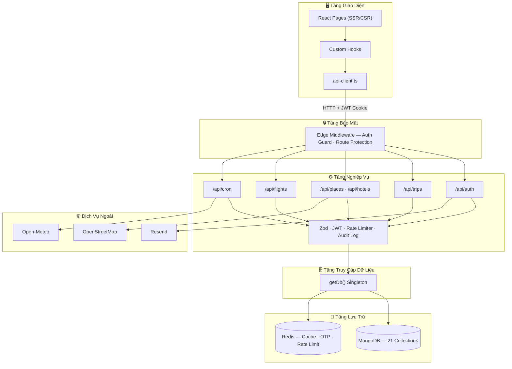
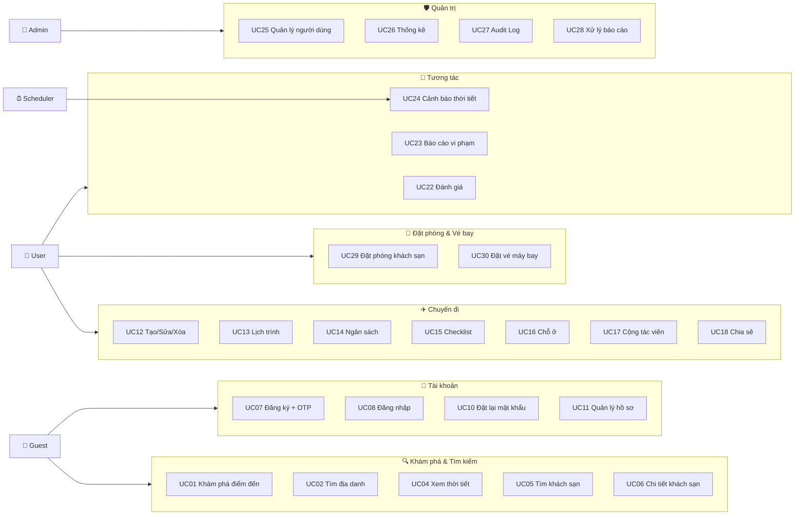
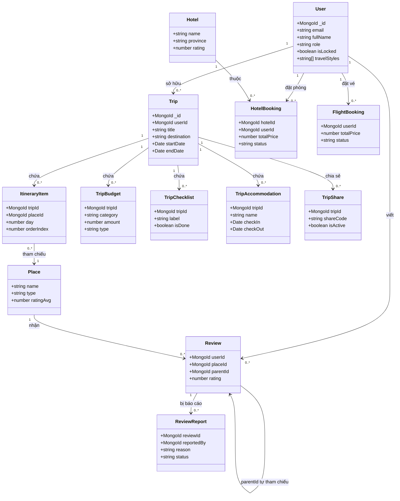

# Smart Travel Guide

> **Đề tài:** Smart Travel Guide — Web hướng dẫn hỗ trợ du lịch
>
> **Môn học:** Đồ án Thực tế Công nghệ Phần mềm

<p align="left">
  
  
  
  
  
  
  
  
  
</p>

Smart Travel Guide là web app hỗ trợ tìm kiếm địa điểm du lịch, xem POI/thời tiết, tìm, đánh giá và đặt phòng khách sạn, tra cứu hãng hàng không nội địa, chọn chuyến bay, đặt vé, quản lý hồ sơ người dùng, lưu địa điểm yêu thích, tạo chuyến đi và lập lịch trình cá nhân (ngân sách, checklist, chỗ ở, cộng tác viên, chia sẻ công khai).

---

## Mục lục

- [Trạng thái dự án](#trạng-thái-dự-án)
- [Công nghệ sử dụng](#công-nghệ-sử-dụng)
- [Kiến trúc hệ thống](#kiến-trúc-hệ-thống)
- [Lược đồ Use Case](#lược-đồ-use-case)
- [Lược đồ Lớp (Class Diagram)](#lược-đồ-lớp-class-diagram)
- [Cấu trúc thư mục](#cấu-trúc-thư-mục)
- [Cài đặt & Chạy local](#cài-đặt--chạy-local)
- [Biến môi trường](#biến-môi-trường)
- [Scripts & Migration](#scripts--migration)
- [Tính năng Khách sạn](#tính-năng-khách-sạn)
- [Đặt phòng & Vé máy bay](#đặt-phòng--vé-máy-bay)
- [API chính](#api-chính)
- [Kiểm thử](#kiểm-thử)
- [Trạng thái chức năng](#trạng-thái-chức-năng)
- [Tài liệu thiết kế](#tài-liệu-thiết-kế)

---

## Trạng thái dự án

Tại mốc kiểm kê **2026-07-14**, hệ thống có:

- **63 file `route.ts`** với **82 HTTP handler** được export
- **21 collection MongoDB**
- **86 file test** với **438 test cases** — tất cả passed ✅

> **Phạm vi điều chỉnh:** Bản đồ trực quan, marker, popup map **đã được loại bỏ hoàn toàn** — không tái giới thiệu.

---

## Công nghệ sử dụng

| Nhóm | Công nghệ | Phiên bản |
| :--- | :--- | :---: |
| Framework | Next.js App Router | 16.x |
| Ngôn ngữ | TypeScript (strict) | 5.x |
| UI | React + Tailwind CSS | 19.x / 4.x |
| Database | MongoDB qua Mongoose | 9.x |
| Cache / OTP / Rate limit | Redis qua ioredis | 5.x |
| Validation | Zod | 4.x |
| Auth | JWT (jose, HS256) — HttpOnly cookie `auth_token` | — |
| Email | Resend | 6.x |
| Password hash | bcryptjs | — |
| Test | Vitest + Playwright | 4.x |
| Font | Be Vietnam Pro (Google Fonts) | — |

---

## Kiến trúc hệ thống

Hệ thống áp dụng mô hình **Next.js App Router (Full-Stack Monolith)** với kiến trúc phân lớp, kết hợp SSR cho SEO và CSR cho trang tương tác.

> 📄 Chi tiết đầy đủ: [`docs/Kien_truc_he_thong.md`](docs/Kien_truc_he_thong.md)



| Tầng | Vai trò | Công nghệ |
| :--- | :--- | :--- |
| Client | Giao diện người dùng, gọi API qua `apiRequest()` | React 19, Tailwind CSS 4 |
| Edge Middleware | Xác thực JWT, bảo vệ route, lọc header giả mạo | Next.js Edge Runtime |
| API Route Handlers | Xử lý nghiệp vụ, validate Zod, rate limit, audit log | Next.js App Router |
| DAL | Truy cập MongoDB qua `getDb()` singleton, cache Redis | Mongoose 9, ioredis 5 |
| Lưu trữ | 21 collection MongoDB, Redis best-effort cache | MongoDB, Redis |
| Dịch vụ ngoài | Geocoding, thời tiết, email | OSM, Open-Meteo, Resend |

---

## Lược đồ Use Case

Hệ thống có **4 tác nhân** tương tác với **6 nhóm chức năng**. User kế thừa Guest, Admin kế thừa User (generalization).

> 📄 Chi tiết: [`docs/Luoc_do_usecase.md`](docs/Luoc_do_usecase.md) · [`docs/02_USE_CASE.md`](docs/02_USE_CASE.md)



<details>
<summary><strong>📋 Bảng tóm tắt 30 Use Case</strong> (click để mở)</summary>

| Mã | Tên | Tác nhân | Mô tả |
| :---: | :--- | :---: | :--- |
| UC01 | Khám phá điểm đến | Guest | Xem danh mục địa phương, điểm du lịch tiêu biểu |
| UC02 | Tìm địa danh | Guest | Nhập từ khóa tìm POI xung quanh |
| UC04 | Xem thời tiết | Guest | Thời tiết hiện tại và dự báo 7 ngày |
| UC05–06 | Tìm & xem khách sạn | Guest | Tìm khách sạn theo tỉnh/thành, xem chi tiết |
| UC07 | Đăng ký | Guest | Đăng ký tài khoản mới qua OTP email |
| UC08 | Đăng nhập | Guest | Đăng nhập bằng email/mật khẩu |
| UC10 | Đặt lại mật khẩu | Guest | OTP email để tạo mật khẩu mới |
| UC11 | Quản lý hồ sơ | User | Sửa thông tin cá nhân, sở thích du lịch |
| UC12 | Quản lý chuyến đi | User | Tạo/sửa/xóa lịch trình chuyến đi |
| UC13 | Lập lịch trình | User | Thêm địa điểm theo ngày, sắp xếp thứ tự |
| UC14 | Ngân sách | User | Chi phí dự kiến và thực tế |
| UC15 | Checklist | User | Danh sách đồ dùng chuẩn bị |
| UC16 | Chỗ ở | User | Lưu thông tin lưu trú |
| UC17 | Cộng tác viên | User | Mời người cùng xem/sửa chuyến đi |
| UC18 | Chia sẻ công khai | User | Chia sẻ chuyến đi qua mã chỉ đọc |
| UC22 | Đánh giá | User | Chấm sao và nhận xét địa điểm/khách sạn |
| UC23 | Báo cáo | User | Báo cáo đánh giá không phù hợp |
| UC24 | Cảnh báo thời tiết | Scheduler | Gửi thông báo/email khi thời tiết xấu |
| UC25 | Quản lý người dùng | Admin | Khóa/mở khóa tài khoản |
| UC26–27 | Thống kê & Audit | Admin | Theo dõi dữ liệu hệ thống, nhật ký |
| UC28 | Xử lý báo cáo | Admin | Phê duyệt/bác bỏ đánh giá bị báo cáo |
| UC29 | Đặt phòng khách sạn | User | Chọn phòng, nhập liên hệ, tạo booking |
| UC30 | Đặt vé máy bay | User | Chọn chuyến bay, nhập hành khách, tạo vé |

</details>

---

## Lược đồ Lớp (Class Diagram)

Các thực thể dữ liệu chính được lưu trong **21 collection MongoDB**.

> 📄 Chi tiết: [`docs/Luoc_do_lop.md`](docs/Luoc_do_lop.md) · [`docs/03_DATA_MODEL.md`](docs/03_DATA_MODEL.md)



| Quan hệ | Kiểu | Mô tả |
| :--- | :---: | :--- |
| User → Trip | 1:N | Mỗi user sở hữu nhiều chuyến đi |
| Trip → Itinerary, Budget, Checklist, Accommodation | 1:N | Composition — xóa trip xóa hết |
| Trip → TripShare | 1:N | Chia sẻ chuyến đi qua mã code |
| ItineraryItem → Place | N:1 | Mỗi mục lịch trình liên kết 1 địa danh |
| User → HotelBooking / FlightBooking | 1:N | Mỗi user có nhiều đơn đặt |
| Review → Review | Self-Ref | `parentId` tạo cây bình luận đa cấp |
| Review → ReviewReport | 1:N | Đánh giá bị báo cáo vi phạm |

---

## Cấu trúc thư mục

```
DATTCNPM/
├── docs/                    # Tài liệu phân tích & thiết kế
├── e2e/                     # Playwright E2E tests
├── public/images/           # Ảnh tĩnh
├── scripts/                 # Import, migration, audit
├── src/
│   ├── app/                 # Next.js App Router
│   │   ├── admin/           # Trang quản trị
│   │   ├── api/             # API Route Handlers
│   │   ├── flights/         # Trang tìm chuyến bay
│   │   ├── hotels/          # Trang khách sạn
│   │   ├── local/           # Trang địa phương
│   │   ├── profile/         # Trang hồ sơ
│   │   ├── share/           # Trang chia sẻ chuyến đi
│   │   └── trips/           # Trang chuyến đi
│   ├── components/          # React components
│   ├── data/                # Dữ liệu tĩnh (JSON, TS)
│   ├── hooks/               # Custom React hooks
│   ├── lib/                 # Utilities & server logic
│   └── types/               # TypeScript types
├── tests/                   # Vitest unit & integration
├── .env.example
├── docker-compose.yml
└── package.json
```

---

## Cài đặt & Chạy local

```bash
# 1. Cài dependencies
npm install

# 2. Tạo file môi trường
copy .env.example .env          # Windows
# cp .env.example .env          # Linux/Mac

# 3. Chạy MongoDB & Redis (nếu dùng Docker)
docker compose up -d

# 4. Chạy dev server
npm run dev
```

Ứng dụng chạy tại **http://localhost:3000**.

---

## Biến môi trường

| Biến | Mục đích |
| :--- | :--- |
| `MONGODB_URI` | Kết nối MongoDB |
| `TEST_MONGODB_URI` | MongoDB riêng cho Vitest (tên chứa segment `test`) |
| `E2E_MONGODB_URI` | MongoDB riêng cho Playwright (tên chứa segment `e2e`) |
| `REDIS_URL` | Kết nối Redis |
| `JWT_SECRET` | Secret ký JWT auth cookie |
| `NEXT_PUBLIC_APP_URL` | URL app |
| `API_KEY_RESEND` | API key Resend |
| `WEBHOOK_SECRET` | Secret cho admin webhook (`x-webhook-secret`) |
| `WEBHOOK_IP_ALLOWLIST` | IP được phép chạy event phá hủy/seed |
| `CRON_SECRET` | Secret cho cron cảnh báo thời tiết (`x-cron-secret`) |

> ⚠️ **Reverse proxy:** Khi deploy, Nginx/Cloudflare **phải** ghi đè `X-Forwarded-For` từ `$remote_addr`, không dùng `$proxy_add_x_forwarded_for`.

---

## Scripts & Migration

| Lệnh | Mục đích |
| :--- | :--- |
| `npm run dev` | Chạy dev server |
| `npm run build` | Build production |
| `npm run start` | Chạy production server |
| `npm run lint` | ESLint |
| `npm run typecheck` | TypeScript no emit |
| `npm test` | Vitest (unit + integration) |
| `npm run test:e2e` | Playwright E2E |

<details>
<summary><strong>🔧 Scripts nâng cao</strong> (click để mở)</summary>

### Audit orderIndex trùng

```bash
npx tsx scripts/audit-itinerary-orderindex.ts
```

### Migration index DB

```bash
# Email: unique → partial unique (cho đăng ký lại sau soft-delete)
npx tsx scripts/migrate-user-email-partial-index.ts --apply

# Checklist: unique index { tripId, label } + collation vi
npx tsx scripts/migrate-checklist-unique-index.ts --apply --i-have-backup
```

### Import khách sạn từ OpenStreetMap

```bash
npx tsx scripts/import-hotels-osm.ts --import                          # tất cả tỉnh hub
npx tsx scripts/import-hotels-osm.ts --import --province="Da Nang"     # 1 tỉnh
npx tsx scripts/import-hotels-osm.ts --import --radius=10000           # bán kính (m)
```

</details>

---

## Tính năng Khách sạn

- **Tìm kiếm:** Trang `/hotels` — tìm theo điểm đến, chuẩn hóa tiếng Việt
- **Chi tiết:** `/hotels/[id]` — gallery, địa chỉ, Google Maps, đánh giá thật
- **Đánh giá:** User chấm sao (1–5) + nhận xét, phân bố sao, lọc theo sao
- **Gợi ý:** Trong chi tiết trip → "Lưu vào chuyến đi" → `TripAccommodation`
- **Dữ liệu:** Import từ OpenStreetMap Overpass, miễn phí, không cần key

> ⚠️ Dataset khách sạn **không tự có** — cần chạy script import trước khi dùng.

---

## ️ Đặt phòng & Vé máy bay

- **Khách sạn:** Chọn loại phòng → nhập thông tin liên hệ → tạo booking → QR thanh toán
- **Vé máy bay:** `/flights` → tìm lịch bay nội địa → chọn chiều đi/về → tạo booking

> 💡 Giá được **tính lại ở server** từ dữ liệu phòng/lịch bay, không tin giá gửi từ client.
> Ứng dụng chưa tích hợp cổng thanh toán thực — hiện chỉ ghi nhận trạng thái nội bộ.

---

## API chính

<details>
<summary><strong>Bảng API đầy đủ</strong> (click để mở)</summary>

| Method | Path | Ghi chú |
| :---: | :--- | :--- |
| `GET` | `/api/health` | Health check |
| `GET` | `/api/debug/db` | Kiểm tra MongoDB |
| `GET` | `/api/debug/redis` | Kiểm tra Redis |
| `POST` | `/api/auth/login` | Đăng nhập, JWT cookie, rate limit |
| `POST` | `/api/auth/logout` | Logout, xóa auth cookie |
| `POST` | `/api/auth/send-otp` | Gửi OTP đăng ký |
| `POST` | `/api/auth/verify-otp` | Xác minh OTP và tạo user |
| `GET` | `/api/profile` | Lấy profile |
| `PATCH` | `/api/profile` | Cập nhật profile |
| `POST` | `/api/profile/password` | Đổi mật khẩu |
| `GET` | `/api/places/search` | Tìm địa điểm (Nominatim/Overpass, Redis cache) |
| `GET` | `/api/places/poi` | Tìm POI quanh tọa độ |
| `GET` | `/api/hotels/search` | Tìm khách sạn theo khu vực |
| `GET` | `/api/hotels/areas` | Khu vực có dữ liệu khách sạn |
| `GET` | `/api/hotels/[id]` | Chi tiết khách sạn |
| `GET/POST` | `/api/hotels/[id]/reviews` | Đánh giá khách sạn |
| `DELETE` | `/api/hotels/[id]/reviews/[reviewId]` | Xoá đánh giá của mình |
| `POST` | `/api/hotels/[id]/bookings` | Tạo đặt phòng |
| `GET` | `/api/bookings/my` | Đơn đặt phòng của tôi |
| `POST` | `/api/bookings/[id]/pay` | Thanh toán đặt phòng |
| `POST` | `/api/flights/bookings` | Tạo đặt vé máy bay |
| `GET` | `/api/flight-bookings/my` | Vé máy bay của tôi |
| `POST` | `/api/flight-bookings/[id]/pay` | Thanh toán vé máy bay |
| `GET` | `/api/admin/bookings` | Admin: danh sách đặt phòng |
| `PATCH` | `/api/admin/bookings/[id]` | Admin: cập nhật trạng thái |
| `GET` | `/api/weather` | Thời tiết Open-Meteo |
| `GET/POST` | `/api/trips` | Danh sách / Tạo trip |
| `GET/PATCH/DELETE` | `/api/trips/[id]` | Chi tiết / Cập nhật / Xóa trip |
| `GET/POST` | `/api/trips/[id]/itinerary` | Lịch trình |
| `PATCH` | `/api/trips/[id]/itinerary/reorder` | Sắp xếp lại (2 pha + compensating write) |
| `POST` | `/api/trips/[id]/checklist/bulk` | Thêm checklist batch |
| `GET/POST/DELETE` | `/api/favorites` | Địa điểm yêu thích |
| `GET/POST/DELETE` | `/api/search-history` | Lịch sử tìm kiếm |
| `GET` | `/api/reviews/my` | Review của user |
| `POST` | `/api/webhook` | Admin/maintenance events |

</details>

---

## Kiểm thử

```bash
npm run lint          # ESLint
npm run typecheck     # TypeScript no emit
npm test              # Vitest (unit + integration)
npm run test:e2e      # Playwright E2E
npm run build         # Build production
```

> Cần MongoDB + Redis đang chạy (`docker compose up -d`).
> `TEST_MONGODB_URI` phải trỏ tới database có segment `test`.
> Mỗi lần chạy tạo database `_run_` riêng và teardown tự động.

---

## Trạng thái chức năng

| Hạng mục | Trạng thái |
| :--- | :---: |
| Bản đồ trực quan / marker / popup | ❌ Đã loại bỏ |
| Tìm kiếm địa điểm + Add-to-trip | ✅ |
| Quản lý chuyến đi đầy đủ | ✅ |
| Đặt phòng khách sạn | ✅ |
| Đặt vé máy bay | ✅ |
| Đánh giá khách sạn (sao + nhận xét) | ✅ |
| Test suite (86 files, 438 tests) | ✅ |
| Cổng thanh toán thực (VNPay, Momo) | ⏳ Chưa tích hợp |
| Responsive + polish UI | 🔄 Đang thực hiện |
| Production deployment | ⏳ Chưa cấu hình |

---

## Tài liệu thiết kế

Toàn bộ tài liệu nằm trong thư mục `docs/`:

| Tài liệu | Nội dung |
| :--- | :--- |
| [`01_SRS.md`](docs/01_SRS.md) | Đặc tả yêu cầu phần mềm — phạm vi, tác nhân, yêu cầu chức năng & phi chức năng |
| [`02_USE_CASE.md`](docs/02_USE_CASE.md) | Đặc tả Use Case — sơ đồ Mermaid, 28 use case chi tiết |
| [`03_DATA_MODEL.md`](docs/03_DATA_MODEL.md) | Thiết kế dữ liệu MongoDB (21 collection) & Redis |
| [`04_SEQUENCE.md`](docs/04_SEQUENCE.md) | Sơ đồ tuần tự 5 luồng xử lý chính |
| [`05_REFACTORING.md`](docs/05_REFACTORING.md) | Báo cáo refactoring — test coverage, lỗi đã sửa |
| [`Kien_truc_he_thong.md`](docs/Kien_truc_he_thong.md) | Kiến trúc hệ thống chi tiết — sơ đồ phân lớp |
| [`Luoc_do_usecase.md`](docs/Luoc_do_usecase.md) | Lược đồ Use Case chi tiết |
| [`Luoc_do_lop.md`](docs/Luoc_do_lop.md) | Lược đồ Lớp chi tiết — thuộc tính & quan hệ |
| [`KE_HOACH_DU_AN.md`](docs/KE_HOACH_DU_AN.md) | Kế hoạch dự án tổng thể |
| [`Plan_Chi_Tiet_Tuan_*.md`](docs/) | Kế hoạch chi tiết từng tuần (tuần 1–6) |
| [`DATTCNPM_Smart_Travel_Guide.docx`](DATTCNPM_Smart_Travel_Guide.docx) | Báo cáo đồ án đầy đủ (Word) |
