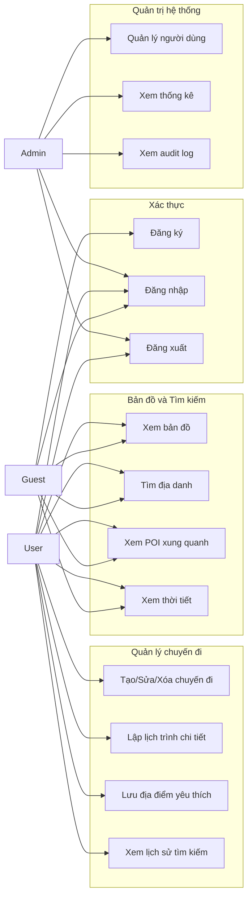

# 2. ĐẶC TẢ USE CASE

## 2.1. Sơ đồ Use Case tổng quát
Sơ đồ Use Case được mô tả bằng Mermaid để có thể render trực tiếp trong tài liệu Markdown hoặc các công cụ hỗ trợ Mermaid.

## 2.2. Danh sách Use Case chính
| Mã UC | Tên Use Case | Actor chính | Mô tả ngắn |
|---|---|---|---|
| **UC01** | Xem bản đồ | Guest/User | Hiển thị bản đồ tương tác. |
| **UC02** | Tìm địa danh | Guest/User | Tìm địa danh theo từ khóa. |
| **UC03** | Xem POI xung quanh | Guest/User | Xem điểm tham quan gần vị trí. |
| **UC04** | Xem thời tiết | Guest/User | Xem thời tiết tại địa điểm. |
| **UC05** | Đăng ký | Guest | Tạo tài khoản mới. |
| **UC06** | Đăng nhập | Guest/User/Admin | Xác thực tài khoản. |
| **UC07** | Đăng xuất | User/Admin | Kết thúc phiên đăng nhập. |
| **UC08** | Tạo/Sửa/Xóa chuyến đi | User | Quản lý chuyến đi cá nhân. |
| **UC09** | Lập lịch trình chi tiết | User | Thêm địa điểm theo ngày và thứ tự. |
| **UC10** | Lưu địa điểm yêu thích | User | Lưu địa điểm quan tâm. |
| **UC11** | Xem lịch sử tìm kiếm | User | Xem lại truy vấn đã tìm. |
| **UC12** | Quản lý người dùng | Admin | Khóa/mở khóa hoặc xem user. |
| **UC13** | Xem thống kê | Admin | Theo dõi dữ liệu hệ thống. |
| **UC14** | Xem audit log | Admin | Xem nhật ký thao tác hệ thống. |

## 2.3. Đặc tả chi tiết Use Case tiêu biểu

### 2.3.1. UC06 - Đăng nhập
| Thành phần | Nội dung |
|---|---|
| **Actor** | Guest, User hoặc Admin. |
| **Điều kiện tiên quyết** | Tài khoản đã tồn tại, chưa bị khóa. |
| **Luồng chính** | 1. Người dùng nhập email và mật khẩu. 2. Hệ thống kiểm tra rate limit theo IP bằng Redis. 3. Hệ thống tìm user theo email trong MongoDB. 4. Hệ thống so khớp mật khẩu hash. 5. Hệ thống tạo JWT/session và lưu vào HttpOnly cookie. |
| **Ngoại lệ** | Sai thông tin đăng nhập, tài khoản bị khóa hoặc vượt rate limit. |
| **Kết quả** | Người dùng đăng nhập thành công và có phiên làm việc hợp lệ. |

### 2.3.2. UC02 - Tìm địa danh
| Thành phần | Nội dung |
|---|---|
| **Actor** | Guest hoặc User. |
| **Điều kiện tiên quyết** | Không bắt buộc đăng nhập. |
| **Luồng chính** | 1. Người dùng nhập từ khóa địa danh. 2. Hệ thống validate từ khóa. 3. Hệ thống kiểm tra cache Redis. 4. Nếu cache miss, hệ thống gọi API geocoding/POI bên ngoài. 5. Hệ thống lưu/cập nhật dữ liệu vào MongoDB và cache Redis. 6. Hệ thống trả danh sách địa điểm cho UI. |
| **Ngoại lệ** | Từ khóa rỗng, API ngoài lỗi hoặc vượt giới hạn truy cập. |
| **Kết quả** | Hiển thị danh sách địa điểm và POI liên quan. |

### 2.3.3. UC08 - Tạo chuyến đi
| Thành phần | Nội dung |
|---|---|
| **Actor** | User. |
| **Điều kiện tiên quyết** | User đã đăng nhập. |
| **Luồng chính** | 1. User nhập tiêu đề, điểm đến và thời gian chuyến đi. 2. Hệ thống validate dữ liệu. 3. Hệ thống kiểm tra JWT/session. 4. Hệ thống tạo document trong collection `trips`. 5. Hệ thống ghi audit log `CREATE_TRIP`. |
| **Ngoại lệ** | Thiếu dữ liệu bắt buộc, ngày không hợp lệ hoặc user chưa đăng nhập. |
| **Kết quả** | Chuyến đi được tạo và hệ thống ghi nhận nhật ký thao tác. |
