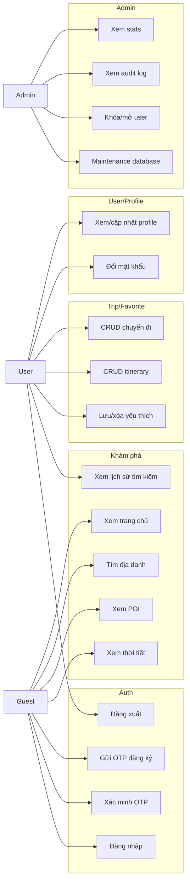

# Đặc tả Use Case - Smart Travel Guide

Ngày cập nhật: 2026-06-09

## 1. Use Case tổng quát

## 2. Danh sách Use Case

| Mã | Tên | Actor | Trạng thái |
| --- | --- | --- | --- |
| UC01 | Xem trang chủ | Guest/User | Đã có |
| UC02 | Tìm địa danh | Guest/User | Đã có |
| UC03 | Xem POI | Guest/User | Đã có |
| UC04 | Xem thời tiết | Guest/User | Đã có |
| UC05 | Gửi OTP đăng ký | Guest | Đã có |
| UC06 | Xác minh OTP | Guest | Đã có |
| UC07 | Đăng nhập | Guest | Đã có JWT cookie và rate limit |
| UC08 | Xem/cập nhật profile | User | Đã có |
| UC09 | Đổi mật khẩu | User | Đã có |
| UC10 | CRUD chuyến đi | User | Đã có |
| UC11 | CRUD itinerary | User | Đã có API và UI demo |
| UC12 | Lưu/xóa yêu thích | User | Đã có |
| UC13 | Xem stats | Admin | Đã có qua webhook |
| UC14 | Xem audit log | Admin | Đã có qua webhook |
| UC15 | Khóa/mở user | Admin | Đã có qua webhook |
| UC16 | Maintenance database | Admin | Đã có qua webhook |
| UC17 | Xem/xóa lịch sử tìm kiếm | User | Có API tối thiểu, chưa có UI riêng |
| UC18 | Đăng xuất | User | Đã có |

## 3. UC07 - Đăng nhập

| Thành phần | Nội dung |
| --- | --- |
| Actor | Guest |
| Điều kiện tiên quyết | User tồn tại và không bị khóa |
| Luồng chính | Nhập email/password, API validate bằng Zod, kiểm tra rate limit, tìm user MongoDB, so khớp bcrypt, ghi audit log `LOGIN`, trả user JSON và set JWT cookie |
| Lưu trạng thái | HttpOnly JWT cookie; client vẫn lưu user trong `localStorage` để tương thích UI |
| Hạn chế | Vẫn hỗ trợ `x-user-id`; Redis session chưa hoàn thiện |

## 4. UC10 - CRUD chuyến đi

| Thành phần | Nội dung |
| --- | --- |
| Actor | User |
| Điều kiện tiên quyết | Có JWT cookie hoặc `x-user-id` |
| Route | `GET/POST /api/trips`, `GET/PATCH/DELETE /api/trips/[id]` |
| Kiểm tra quyền | Route dynamic chỉ thao tác trip có `userId` khớp user hiện tại |
| Audit log | Tạo/sửa/xóa trip ghi audit log nếu ghi log thành công |

## 5. UC11 - CRUD Itinerary

| Thành phần | Nội dung |
| --- | --- |
| Actor | User |
| Route | `GET/POST /api/trips/[id]/itinerary`, `PATCH/DELETE /api/trips/[id]/itinerary/[itemId]` |
| Điều kiện | Trip phải thuộc user hiện tại, placeId phải tồn tại khi thêm/sửa place |
| UI | `TripDetailModal` hiển thị theo ngày/thứ tự và hỗ trợ thêm/sửa/xóa item |

## 6. UC17 - Search History

| Thành phần | Nội dung |
| --- | --- |
| Actor | User |
| Route | `GET/POST/DELETE /api/search-history`, `DELETE /api/search-history/[id]` |
| Điều kiện | Có JWT cookie hoặc `x-user-id` |
| Luồng chính | Search có user sẽ tự ghi lịch sử; user có thể gọi API để xem, thêm thủ công hoặc xóa lịch sử |
| Hạn chế | Chưa có UI riêng cho search history |
