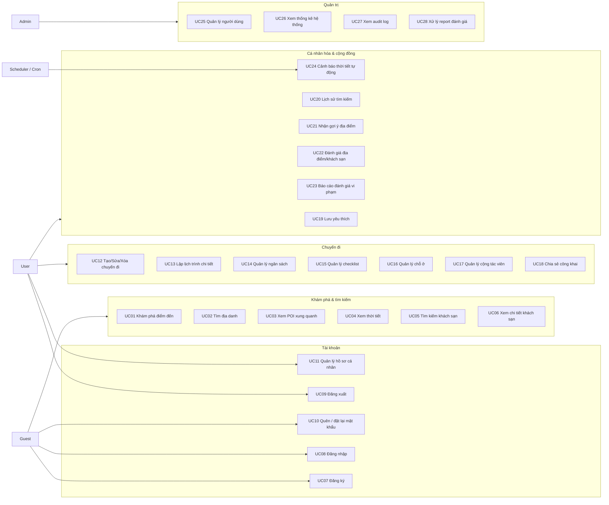

# Đặc tả Use Case - Smart Travel Guide

Đề tài: **Smart Travel Guide - Web hướng dẫn hỗ trợ du lịch**

Ngày cập nhật: 2026-07-11 (đồng bộ với báo cáo `DATTCNPM_Smart_Travel_Guide.docx`)

## 1. Sơ đồ Use Case tổng quát

Hệ thống có 5 nhóm chức năng chính (Khám phá & tìm kiếm, Tài khoản, Chuyến đi, Tương tác cộng đồng, Quản trị). **User kế thừa toàn bộ use case của Guest, Admin kế thừa toàn bộ use case của User** (quan hệ generalization).

```mermaid
flowchart LR
    Guest[Guest]
    User[User]
    Admin[Admin]
    Cron[Scheduler / Cron]

    subgraph Explore [Khám phá & tìm kiếm]
        UC01[UC01 Khám phá điểm đến]
        UC02[UC02 Tìm địa danh]
        UC03[UC03 Xem POI xung quanh]
        UC04[UC04 Xem thời tiết]
        UC05[UC05 Tìm kiếm khách sạn]
        UC06[UC06 Xem chi tiết khách sạn]
    end

    subgraph Auth [Tài khoản]
        UC07[UC07 Đăng ký]
        UC08[UC08 Đăng nhập]
        UC09[UC09 Đăng xuất]
        UC10[UC10 Quên / đặt lại mật khẩu]
        UC11[UC11 Quản lý hồ sơ cá nhân]
    end

    subgraph Trip [Chuyến đi]
        UC12[UC12 Tạo/Sửa/Xóa chuyến đi]
        UC13[UC13 Lập lịch trình chi tiết]
        UC14[UC14 Quản lý ngân sách]
        UC15[UC15 Quản lý checklist]
        UC16[UC16 Quản lý chỗ ở]
        UC17[UC17 Quản lý cộng tác viên]
        UC18[UC18 Chia sẻ công khai]
    end

    subgraph Social [Cá nhân hóa & cộng đồng]
        UC19[UC19 Lưu yêu thích]
        UC20[UC20 Lịch sử tìm kiếm]
        UC21[UC21 Nhận gợi ý địa điểm]
        UC22[UC22 Đánh giá địa điểm/khách sạn]
        UC23[UC23 Báo cáo đánh giá vi phạm]
        UC24[UC24 Cảnh báo thời tiết tự động]
    end

    subgraph AdminPanel [Quản trị]
        UC25[UC25 Quản lý người dùng]
        UC26[UC26 Xem thống kê hệ thống]
        UC27[UC27 Xem audit log]
        UC28[UC28 Xử lý report đánh giá]
    end

    Guest --> Explore
    Guest --> UC07
    Guest --> UC08
    Guest --> UC10
    User --> UC09
    User --> UC11
    User --> Trip
    User --> Social
    Cron --> UC24
    Admin --> AdminPanel
```

## 2. Danh sách Use Case

| Mã UC | Tên Use Case | Actor chính | Mô tả ngắn |
| --- | --- | --- | --- |
| UC01 | Khám phá điểm đến | Guest/User | Xem trang chủ và khám phá điểm đến nổi bật |
| UC02 | Tìm địa danh | Guest/User | Tìm địa danh theo từ khóa |
| UC03 | Xem POI xung quanh | Guest/User | Xem điểm tham quan gần vị trí |
| UC04 | Xem thời tiết | Guest/User | Xem thời tiết tại địa điểm |
| UC05 | Tìm kiếm khách sạn | Guest/User | Tìm khách sạn theo điểm đến/khu vực |
| UC06 | Xem chi tiết khách sạn | Guest/User | Xem chi tiết và đánh giá khách sạn |
| UC07 | Đăng ký | Guest | Tạo tài khoản mới, xác thực qua OTP |
| UC08 | Đăng nhập | Guest/User/Admin | Xác thực tài khoản |
| UC09 | Đăng xuất | User/Admin | Kết thúc phiên |
| UC10 | Quên / đặt lại mật khẩu | Guest | Đặt lại mật khẩu qua email |
| UC11 | Quản lý hồ sơ cá nhân | User | Cập nhật thông tin, sở thích, đổi mật khẩu |
| UC12 | Tạo/Sửa/Xóa chuyến đi | User | Quản lý chuyến đi cá nhân |
| UC13 | Lập lịch trình chi tiết | User | Thêm địa điểm theo ngày và sắp xếp thứ tự |
| UC14 | Quản lý ngân sách chuyến đi | User | Ghi nhận chi phí dự kiến/thực tế |
| UC15 | Quản lý checklist chuyến đi | User | Quản lý việc cần chuẩn bị |
| UC16 | Quản lý chỗ ở chuyến đi | User | Lưu thông tin nơi lưu trú |
| UC17 | Quản lý cộng tác viên | User | Mời người cùng xem/sửa chuyến đi |
| UC18 | Chia sẻ chuyến đi công khai | User | Chia sẻ chuyến đi qua mã/liên kết (trang share hiển thị lịch trình, khách sạn, chi phí dự tính, chỉ xem) |
| UC19 | Lưu địa điểm yêu thích | User | Lưu địa điểm quan tâm |
| UC20 | Xem lịch sử tìm kiếm | User | Xem lại truy vấn đã tìm |
| UC21 | Nhận gợi ý địa điểm | User | Nhận gợi ý cá nhân hóa |
| UC22 | Đánh giá địa điểm / khách sạn | User | Chấm điểm và nhận xét |
| UC23 | Báo cáo đánh giá vi phạm | User | Báo cáo đánh giá không phù hợp |
| UC24 | Nhận cảnh báo thời tiết tự động | User/Scheduler | Cảnh báo thời tiết cho chuyến đi sắp diễn ra |
| UC25 | Quản lý người dùng | Admin | Khóa/mở khóa hoặc xem user |
| UC26 | Xem thống kê hệ thống | Admin | Theo dõi dữ liệu hệ thống |
| UC27 | Xem audit log | Admin | Xem nhật ký thao tác |
| UC28 | Xử lý report đánh giá | Admin | Xử lý report đánh giá vi phạm |

## 3. Đặc tả chi tiết

Đặc tả chi tiết từng use case (actor, điều kiện tiên quyết, luồng chính, ngoại lệ, kết quả) được trình bày đầy đủ tại **mục 2.3 của báo cáo `DATTCNPM_Smart_Travel_Guide.docx`**.
