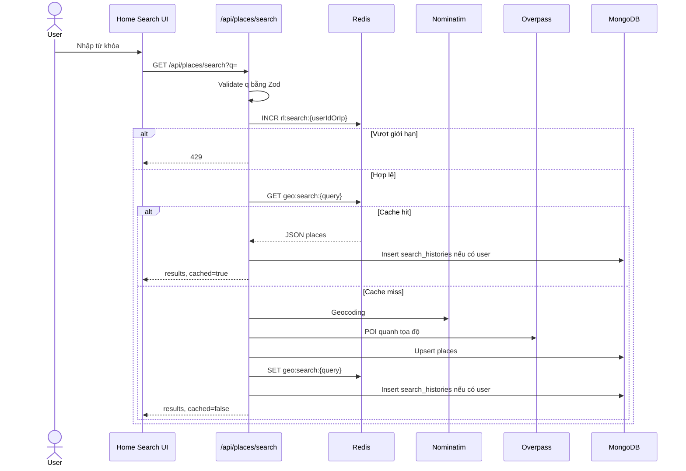
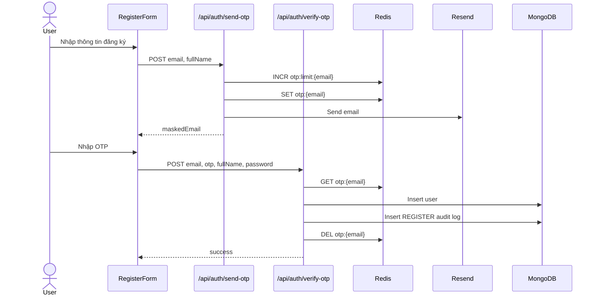
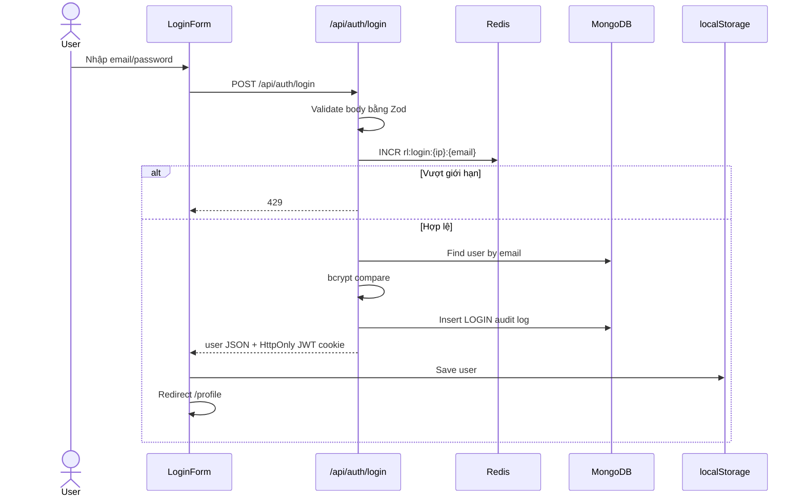
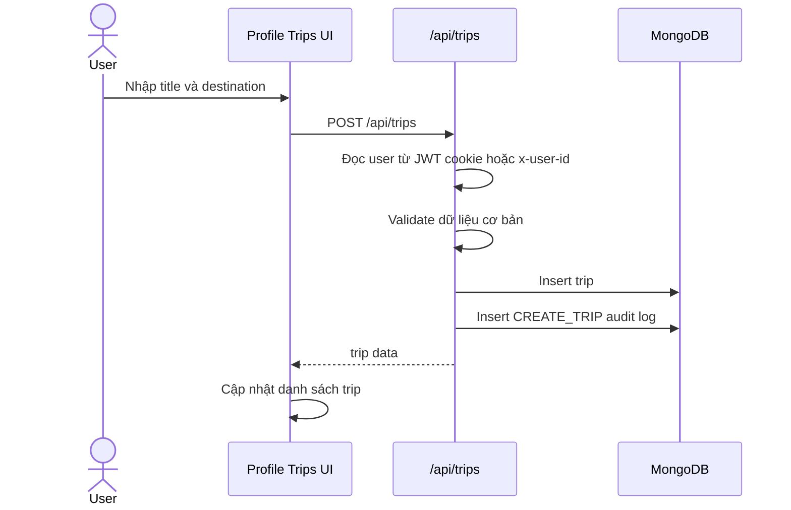
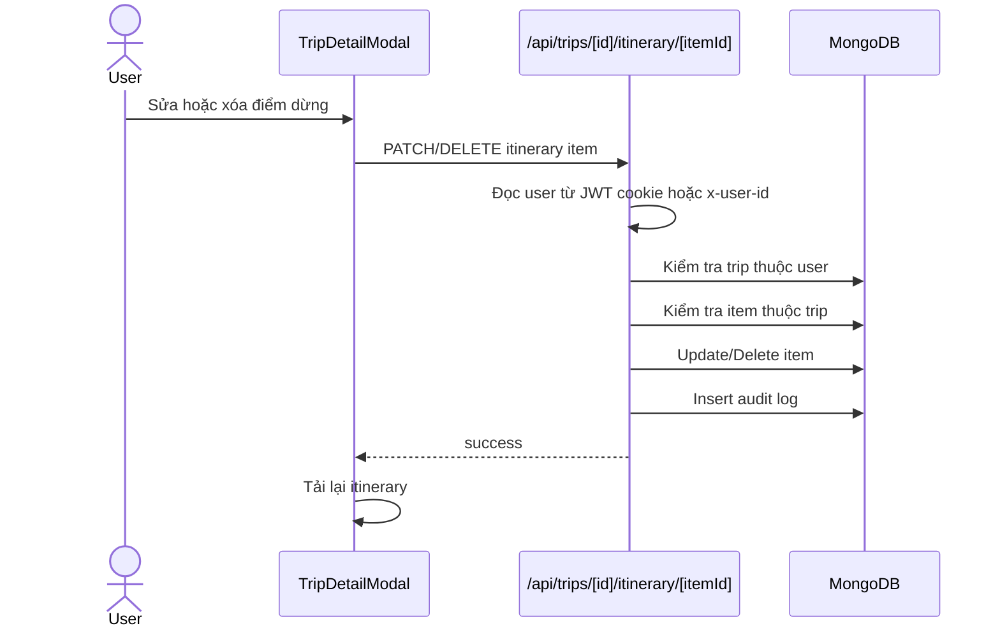
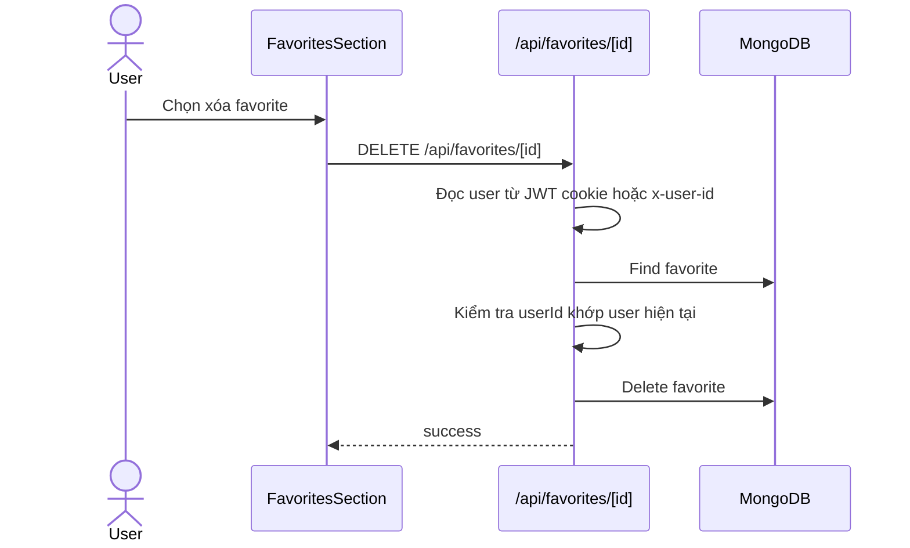

# Sequence Diagram - Smart Travel Guide

Ngày cập nhật: 2026-06-09

## 1. Tìm kiếm địa danh có rate limit, cache và search history

## 2. Đăng ký bằng OTP

## 3. Đăng nhập hiện tại

Ghi chú: flow này đã có JWT cookie, nhưng vẫn giữ `localStorage` để tương thích UI hiện tại. Redis session là mục tiêu thiết kế cần hoàn thiện sau.

## 4. Tạo chuyến đi

## 5. Sửa/xóa itinerary item

## 6. Xóa favorite

