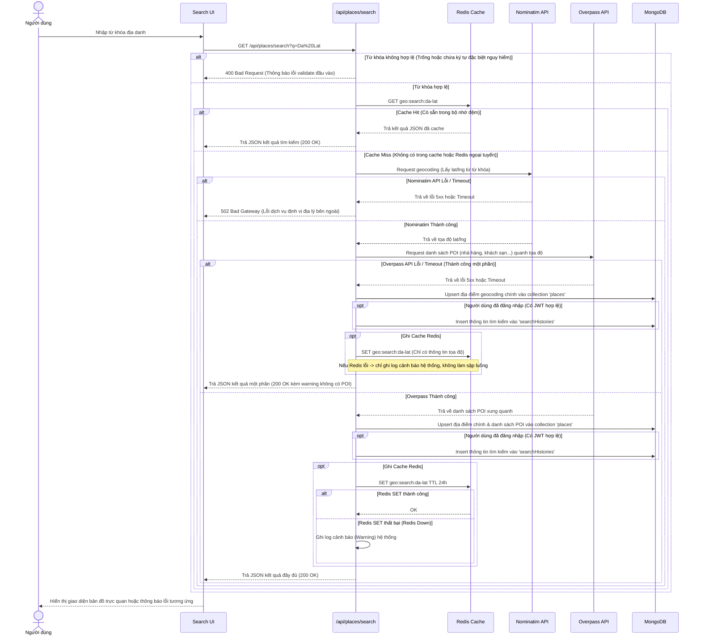
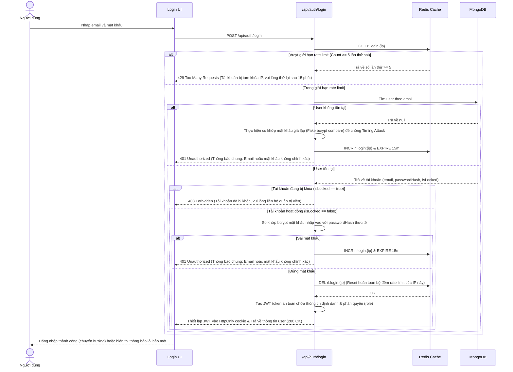
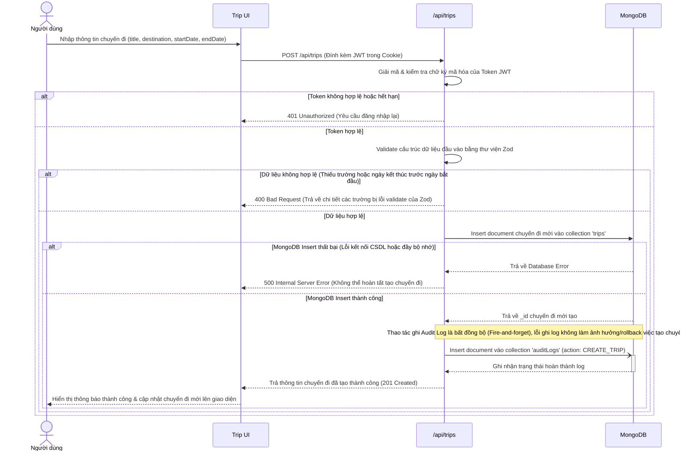

# 4. SƠ ĐỒ TUẦN TỰ CÁC LUỒNG XỬ LÝ CHÍNH KÈM XỬ LÝ LỖI

## 4.1. Luồng tìm kiếm địa danh có cache (kèm xử lý lỗi & lưu lịch sử)
Sơ đồ mô tả quy trình tìm kiếm địa danh được tối ưu bằng Redis cache. Quy trình được thiết kế chống chịu lỗi khi API bên thứ ba (Nominatim, Overpass) hoặc Redis gặp sự cố, đồng thời tự động lưu trữ lịch sử nếu người dùng đã đăng nhập.

---

## 4.2. Luồng đăng nhập có rate limit & chống tấn công dò quét
Sơ đồ mô tả quy trình đăng nhập được bảo vệ bằng cơ chế Rate Limit sử dụng Redis IP Tracking để chống lại các cuộc tấn công Brute-force mật khẩu. Luồng được thiết kế bảo mật cao để chống Timing Attack và chống dò quét tài khoản (Username Enumeration).

---

## 4.3. Luồng tạo chuyến đi có audit log (kèm xác thực & rollback)
Sơ đồ mô tả luồng tạo chuyến đi mới của một thành viên đã đăng nhập. Việc tạo chuyến đi đòi hỏi xác thực token JWT, xác thực cấu trúc dữ liệu đầu vào bằng Zod, xử lý lỗi ghi cơ sở dữ liệu MongoDB và ghi nhận hành vi thao tác vào collection `auditLogs`.

