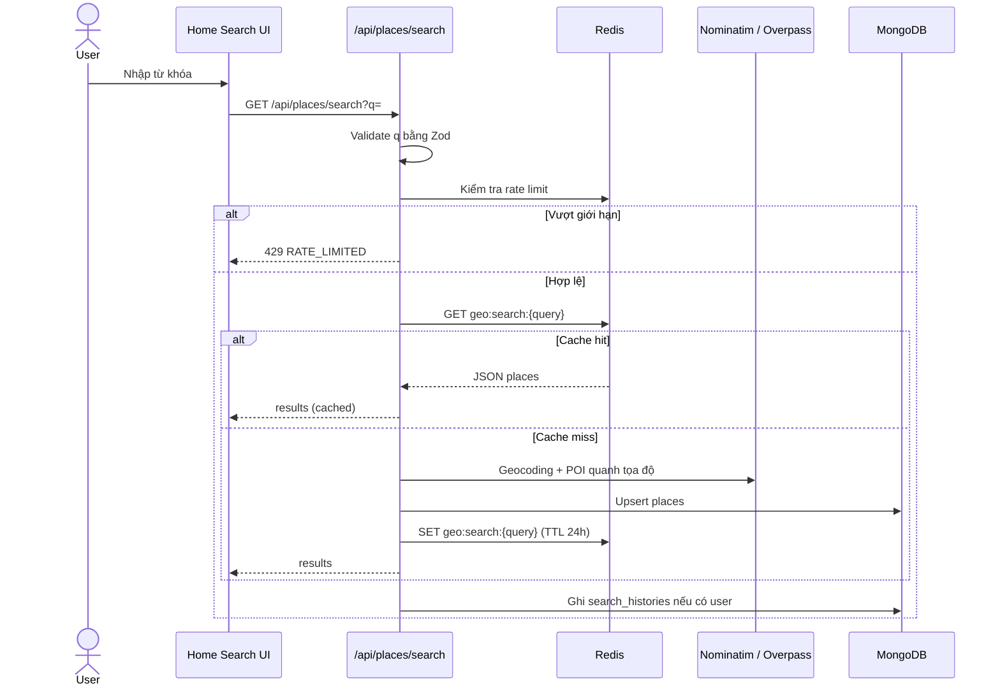
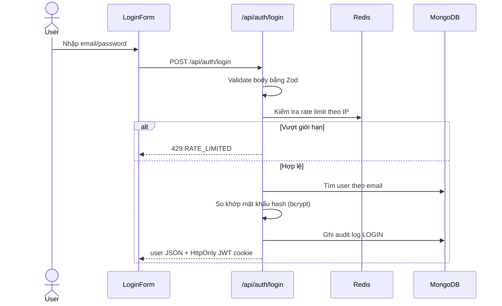
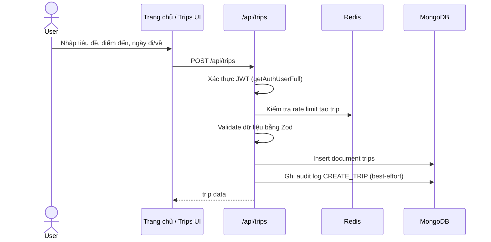
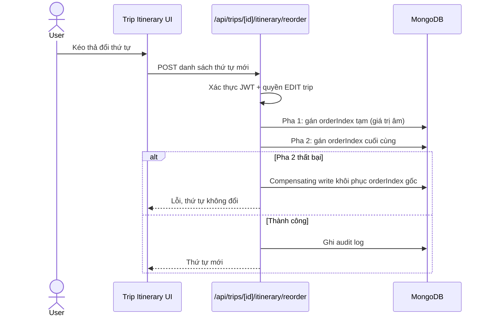
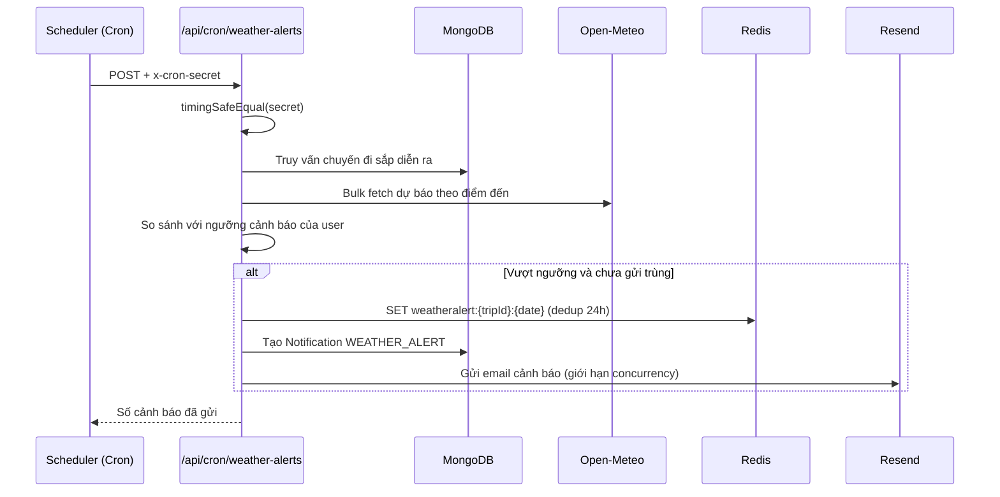

# Sơ đồ tuần tự các luồng xử lý chính - Smart Travel Guide

Đề tài: **Smart Travel Guide - Web hướng dẫn hỗ trợ du lịch**

Ngày cập nhật: 2026-07-11 (đồng bộ với báo cáo `DATTCNPM_Smart_Travel_Guide.docx`)

## 1. Luồng tìm kiếm địa danh có cache

```mermaid
sequenceDiagram
    actor User
    participant UI as Home Search UI
    participant API as /api/places/search
    participant Redis as Redis
    participant OSM as Nominatim / Overpass
    participant Mongo as MongoDB

    User->>UI: Nhập từ khóa
    UI->>API: GET /api/places/search?q=
    API->>API: Validate q bằng Zod
    API->>Redis: Kiểm tra rate limit
    alt Vượt giới hạn
        API-->>UI: 429 RATE_LIMITED
    else Hợp lệ
        API->>Redis: GET geo:search:{query}
        alt Cache hit
            Redis-->>API: JSON places
            API-->>UI: results (cached)
        else Cache miss
            API->>OSM: Geocoding + POI quanh tọa độ
            API->>Mongo: Upsert places
            API->>Redis: SET geo:search:{query} (TTL 24h)
            API-->>UI: results
        end
        API->>Mongo: Ghi search_histories nếu có user
    end
```

## 2. Luồng đăng nhập có rate limit

```mermaid
sequenceDiagram
    actor User
    participant UI as LoginForm
    participant API as /api/auth/login
    participant Redis as Redis
    participant Mongo as MongoDB

    User->>UI: Nhập email/password
    UI->>API: POST /api/auth/login
    API->>API: Validate body bằng Zod
    API->>Redis: Kiểm tra rate limit theo IP
    alt Vượt giới hạn
        API-->>UI: 429 RATE_LIMITED
    else Hợp lệ
        API->>Mongo: Tìm user theo email
        API->>API: So khớp mật khẩu hash (bcrypt)
        API->>Mongo: Ghi audit log LOGIN
        API-->>UI: user JSON + HttpOnly JWT cookie
    end
```

## 3. Luồng tạo chuyến đi có audit log

```mermaid
sequenceDiagram
    actor User
    participant UI as Trang chủ / Trips UI
    participant API as /api/trips
    participant Redis as Redis
    participant Mongo as MongoDB

    User->>UI: Nhập tiêu đề, điểm đến, ngày đi/về
    UI->>API: POST /api/trips
    API->>API: Xác thực JWT (getAuthUserFull)
    API->>Redis: Kiểm tra rate limit tạo trip
    API->>API: Validate dữ liệu bằng Zod
    API->>Mongo: Insert document trips
    API->>Mongo: Ghi audit log CREATE_TRIP (best-effort)
    API-->>UI: trip data
```

## 4. Luồng sắp xếp lại lịch trình (2 pha)

Việc kéo thả sắp xếp lại thứ tự phải tránh vi phạm unique index `{tripId, day, orderIndex}`. MongoDB chạy standalone (không transaction) nên dùng kỹ thuật **hai pha**: gán orderIndex tạm âm ở pha 1, gán giá trị cuối ở pha 2; nếu pha 2 thất bại thì tự động compensating write khôi phục orderIndex gốc.

```mermaid
sequenceDiagram
    actor User
    participant UI as Trip Itinerary UI
    participant API as /api/trips/[id]/itinerary/reorder
    participant Mongo as MongoDB

    User->>UI: Kéo thả đổi thứ tự
    UI->>API: POST danh sách thứ tự mới
    API->>API: Xác thực JWT + quyền EDIT trip
    API->>Mongo: Pha 1: gán orderIndex tạm (giá trị âm)
    API->>Mongo: Pha 2: gán orderIndex cuối cùng
    alt Pha 2 thất bại
        API->>Mongo: Compensating write khôi phục orderIndex gốc
        API-->>UI: Lỗi, thứ tự không đổi
    else Thành công
        API->>Mongo: Ghi audit log
        API-->>UI: Thứ tự mới
    end
```

## 5. Luồng cảnh báo thời tiết tự động (cron)

Tác vụ định kỳ gọi API cảnh báo thời tiết, xác thực bằng `x-cron-secret` so khớp an toàn (timingSafeEqual). Hệ thống bulk fetch thời tiết để tránh N+1 request, dùng Redis khử trùng lặp cảnh báo, giới hạn concurrency khi gửi email.

```mermaid
sequenceDiagram
    participant Cron as Scheduler (Cron)
    participant API as /api/cron/weather-alerts
    participant Mongo as MongoDB
    participant Meteo as Open-Meteo
    participant Redis as Redis
    participant Resend as Resend

    Cron->>API: POST + x-cron-secret
    API->>API: timingSafeEqual(secret)
    API->>Mongo: Truy vấn chuyến đi sắp diễn ra
    API->>Meteo: Bulk fetch dự báo theo điểm đến
    API->>API: So sánh với ngưỡng cảnh báo của user
    alt Vượt ngưỡng và chưa gửi trùng
        API->>Redis: SET weatheralert:{tripId}:{date} (dedup 24h)
        API->>Mongo: Tạo Notification WEATHER_ALERT
        API->>Resend: Gửi email cảnh báo (giới hạn concurrency)
    end
    API-->>Cron: Số cảnh báo đã gửi
```
